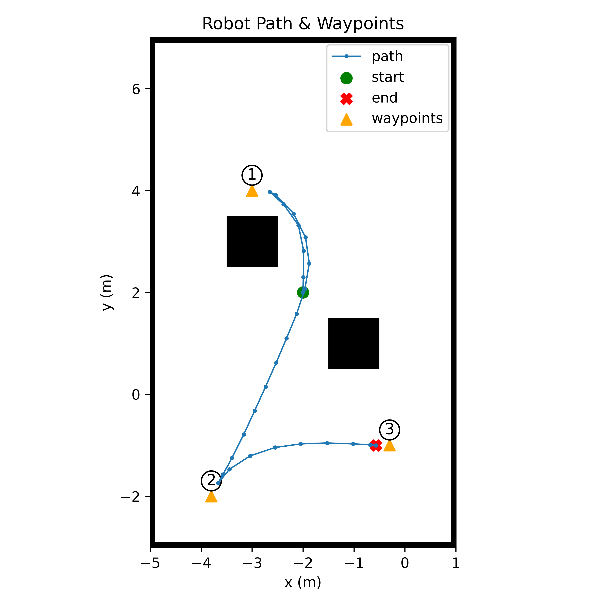

# Technical Challenge

ROS 2 Humble + Nav2 + Gazebo simulation of a robot that visits a small list of waypoints. Position + simple status string are written to a local Ganache blockchain (self transactions carrying JSON). A script later walks the chain and rebuilds a JSON log.

## Main Pieces
| Area | File / Path | Purpose |
|------|-------------|---------|
| Simulation pkg | `src/sdnt_robot_simulation` | URDF, world, map, launch, Nav2 setup |
| Launch | `src/sdnt_robot_simulation/launch/simulation.launch.py` | Starts gzserver, robot_state_publisher, ekf, map server, AMCL, Nav2, RViz, static TF |
| URDF | `src/sdnt_robot_simulation/src/description/sdnt_robot_description.urdf` | Robot description used for spawn_entity |
| World | `src/sdnt_robot_simulation/world/warehouse.world` | Gazebo world loaded by `gzserver` |
| Map | `src/sdnt_robot_simulation/maps/warehouse.yaml` (+ pgm) | 2D map for Nav2 global planning |
| Waypoint follower (sequential) | `src/follow_waypoints_pkg/follow_waypoints_pkg/odom_follower.py` | Sequential `navigate_to_pose` goals with early distance-based completion + status publishing |
| Waypoint follower (batch) | `src/follow_waypoints_pkg/follow_waypoints_pkg/go_through_poses.py` | Single `navigate_through_poses` goal containing all waypoints |
| Waypoint follower (gps prototype) | `src/follow_waypoints_pkg/follow_waypoints_pkg/gps_follower.py` | Sequential `navigate_to_pose` goals from lat/long CSV (simple scaling) |
| Waypoints CSV | `src/follow_waypoints_pkg/resource/odom_waypoints.csv` | 3 waypoints (see below) |
| Logger | `Tools/blockchain_logger.py` | Subscribes `/odom` + `/nav2_status`, logs on move/status change |
| Extractor | `Tools/extract_blockchain_data.py` | Scans blocks, decodes movement tx payloads |
| Orchestrator | `run.sh` | Cleans, builds, starts Ganache, sim, logger, follower, extractor |
| Setup script | `setup.sh` | Installs ROS 2 Humble (if missing), Node 18, ganache-cli, web3 |

## Waypoints (CSV)
File: `src/follow_waypoints_pkg/resource/odom_waypoints.csv`
```
(`x` ,  `y`)
(-2.0, -1.0)
( 4.0, -1.8)
( 3.0,  1.7)
```
Frame: `map`

## Waypoint Follower Variants
- `odom_follower.py`: Loads `odom_waypoints.csv`, sends each waypoint via `navigate_to_pose`, publishes status transitions on `/nav2_status` (`waitin`, `get target`, `moving`, `reached target`), and cancels early once within 0.20 m to speed progression.
- `go_through_poses.py`: Loads same CSV, sends a single `navigate_through_poses` goal (no intermediate status publishing). Lets Nav2 handle internal sequencing.
- `gps_follower.py`: Loads `gps_waypoints.csv`, scales latitude/longitude to map x/y with fixed divisors (placeholder), sends sequential `navigate_to_pose` goals (no status publisher).

Only the odometry sequential variant produces the status strings consumed by the blockchain logger.

## Topics / Actions Used
- `/odom` (nav_msgs/Odometry) consumed by logger.
- `/nav2_status` (std_msgs/String) produced by follower, consumed by logger.
- Action `navigate_to_pose` (Nav2 NavigateToPose) used by sequential and GPS followers.
- Action `navigate_through_poses` (Nav2 NavigateThroughPoses) used by batch follower.
- `/amcl_pose` used by follower to approximate position for early goal completion (0.20 m tolerance).

## Launch Details
`simulation.launch.py`:
- Starts `gzserver` with: `warehouse.world` and plugins `libgazebo_ros_init.so` and `libgazebo_ros_factory.so`.
- Spawns entity name `sdnt_robot` (Z 0.18).
- Nodes: robot_state_publisher, joint_state_publisher, ekf (`robot_localization`), static TF (map->odom), map_server, AMCL, Nav2 bringup (`navigation_launch.py`), lifecycle manager for map_server, RViz2 with `rviz/display.rviz`.

## Ganache Settings (from `run.sh`)
```
ganache-cli \
    --port 8545 \
    --deterministic \
    --networkId 1337 \
    --gasLimit 10000000 \
    --gasPrice 20000000000 \
    --accounts 10 \
    --defaultBalanceEther 100 \
    --blockTime 15 \
    --db blockchain_data
```
First account (`accounts[0]`) is used as both `from` and `to`.

## Logging Logic (Blockchain Logger)
- Timer: 1.0 s.
- Movement threshold: > 0.1 m (planar distance) OR status string change.
- Data object: `{ timestamp, robot: { time, x, y, status } }` (x,y rounded to 3 decimals).
- Encoded: UTF‑8 JSON -> hex string (prefixed `0x`).
- Gas estimate formula in code: `21000 + 16 * (payload bytes)` (implemented as `21000 + (len(data_hex)-2)*16`).
- If chain not reachable: append JSON to `records/movement_log.json`.

## Extractor Logic
- Iterates blocks 0..latest.
- Selects transactions where `from == to == account[0]` and `input` length > 10.
- Decodes `tx.input` directly as UTF‑8 JSON.
- Collects list with `block_number`, `transaction_hash`, `timestamp`, `human_time`, `robot`.
- Sorts by `timestamp` and writes `records/decoded_blockchain_logs.json`.
- Prints summary (first/last time, total count, start/end position).

## Files Produced After Successful Run
- `blockchain_data/` (persistent Ganache DB)
- `records/decoded_blockchain_logs.json` (decoded chain logs)
- (Fallback) `records/movement_log.json` if chain unavailable during logging.

## Setup (Global Installs)
Script: `./setup.sh`
Installs (if missing): `ros-humble-desktop`, `python3-colcon-common-extensions`, `python3-pip`, `build-essential`, `git`, `gnome-terminal`, Node.js 18 (NodeSource), `ganache-cli` (npm -g), `web3` (pip3). No virtualenv.

Run it:
```bash
./setup.sh
```

## Build & Run (Automated)
```bash
source /opt/ros/humble/setup.bash
./run.sh
```
`run.sh` steps (sequential):
1. Kill leftover gazebo / rviz / ros2 processes.
2. Remove `build/ log/ install/`.
3. `colcon build`.
4. Start Ganache (in new terminal) with settings above (persistent DB `blockchain_data`).
5. Launch simulation (new terminal): `ros2 launch sdnt_robot_simulation simulation.launch.py`.
6. Start `blockchain_logger.py` (background in same shell).
7. Launch waypoint follower (new terminal): `ros2 run follow_waypoints_pkg odom_follower`.
8. After delay, run extractor (`extract_blockchain_data.py`).

## Manual Run (Pieces)
```bash
source /opt/ros/humble/setup.bash
colcon build
source install/setup.bash
ganache-cli --port 8545 --deterministic --networkId 1337 --db blockchain_data \
	--gasLimit 10000000 --gasPrice 20000000000 --accounts 10 --defaultBalanceEther 100 --blockTime 15 &
ros2 launch sdnt_robot_simulation simulation.launch.py &
python Tools/blockchain_logger.py &
ros2 run follow_waypoints_pkg odom_follower &
python Tools/extract_blockchain_data.py
```

## Troubleshooting
| Issue | Note |
|-------|------|
| No decoded file | Make sure extractor ran after some movement |
| No transactions | Check Ganache terminal for startup; port 8545 must be free |
| `web3` import error | Install globally: `sudo pip3 install web3` |
| Stuck at action server wait | Ensure Nav2 stack launched (see sim terminal) |

## Evaluation Relation
- Goal: visit 3 waypoints (listed above) via Nav2 NavigateToPose.
- Data recorded: timestamp, x, y, status (change-triggered + movement threshold).
- Visualization: RViz config `rviz/display.rviz` (launched automatically).
- Blockchain: Ganache local chain, self transactions store JSON.

## Extra Visualization
After a run you can generate a simple static plot (map + path + waypoints + start/end):
```bash
python Tools/vizualization.py
```
Output image: `records/path_plot.png`.

### Sample Output


### Demo Video
`demo.webm` (recorded run):
<video src="records/demo.webm" controls loop muted style="max-width:100%;height:auto;">
Your browser does not support the video tag.
</video>

## Additional Docs
See `docs/waypoint_follower.md` for a concise breakdown of the three follower nodes.
See `docs/blockchain_logger.md` for details on the logging and blockchain integration.
See `docs/simulation.md` for an overview of the simulation setup and launch sequence.
